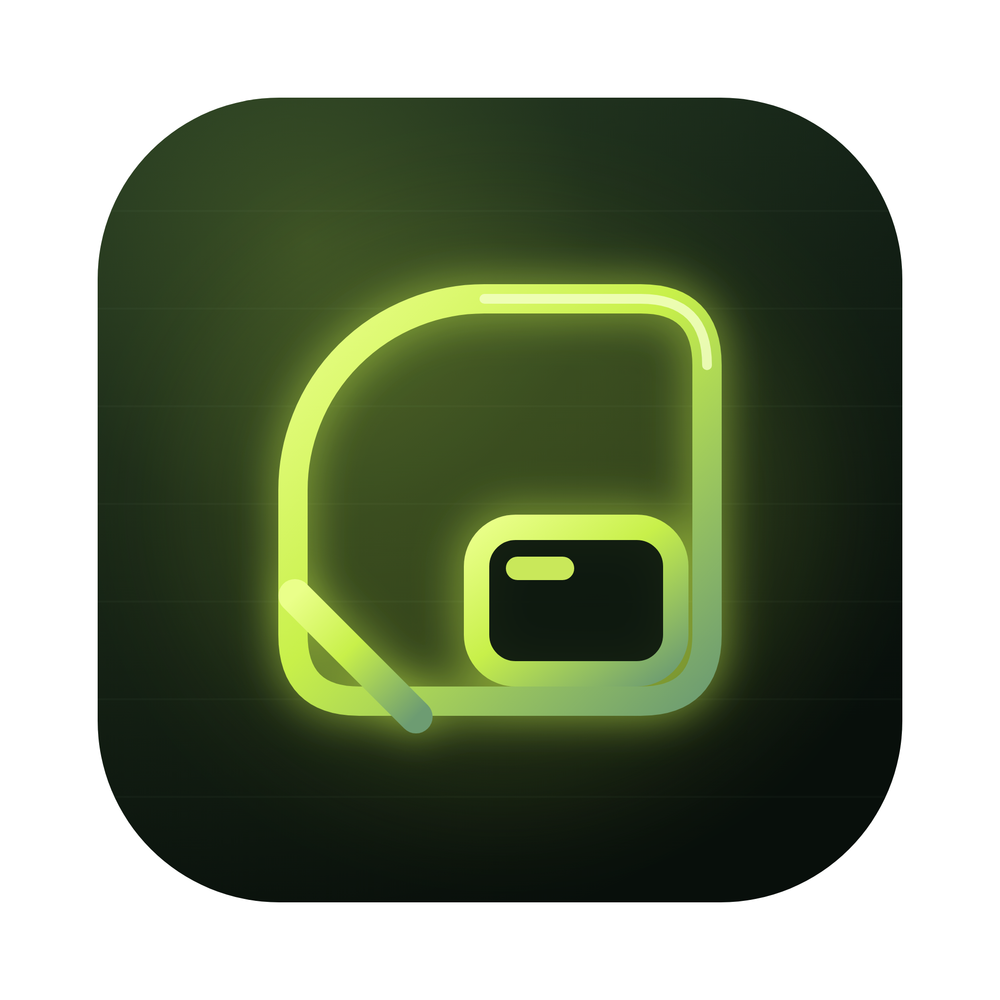
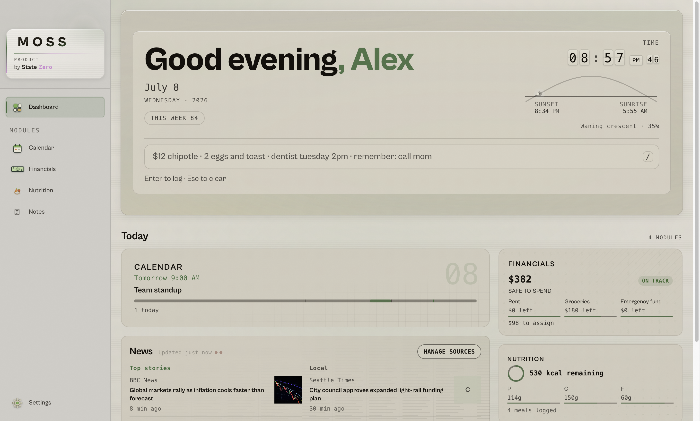
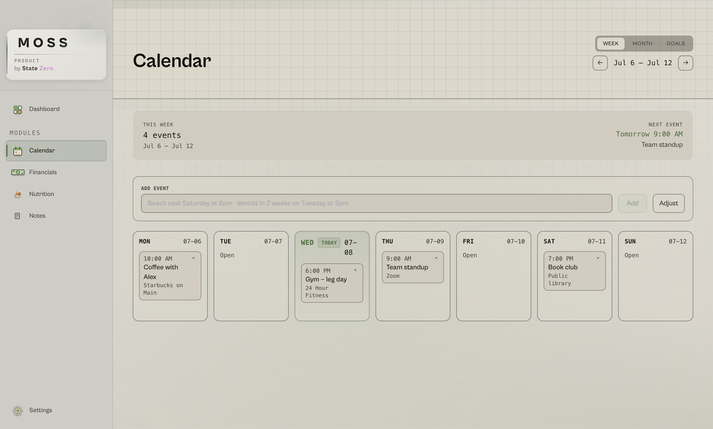
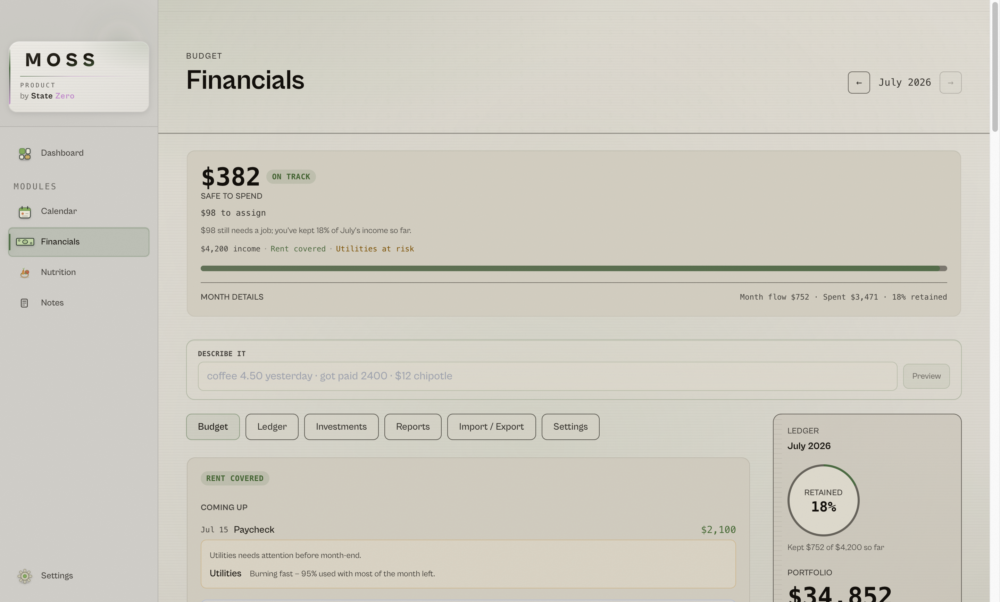
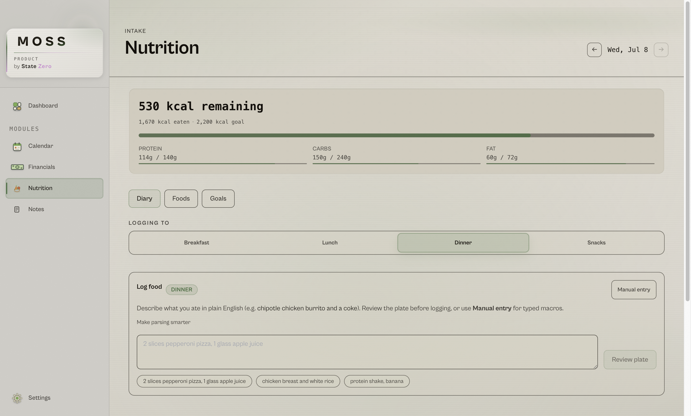
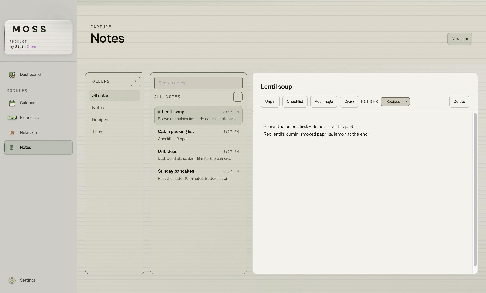

<div align="center">



# MOSS

**Your day on one quiet screen — and none of it ever leaves your computer.**

Calendar · Money · Meals · News · Email · Notes


**[Download](#install)** · [Your first 60 seconds](#your-first-60-seconds) · [Why it's private](#nothing-to-log-into-nothing-to-leak) · [FAQ](#faq)

</div>

<picture>
  <source media="(prefers-color-scheme: dark)" srcset="docs/screenshots/dashboard-dark.png">
  
</picture>

MOSS is one warm home screen for the things you actually check every day. Open it in the morning, see your day, get on with it. There is **no MOSS account**, **no ads**, and **no feed** engineered to keep you scrolling — your data lives in a database on **your own computer**, and we don't run a server that holds your life.

It's built for a normal person with a job, classes, or a household — not for someone who wants twelve linked accounts and a trading terminal. One app, quietly replacing the five you open out of habit.

---

## What MOSS is

<table>
<tr>
<td width="55%"></td>
<td width="45%">

### Your week, in your words

Sign in with Google or paste a calendar link, then add things the way you'd say them: type **"dentist next Friday at 2"** and it's on the calendar. Week and month views, no project-management cosplay.

</td>
</tr>
<tr>
<td width="55%"></td>
<td width="45%">

### Money that answers one question

*Can I spend this?* Envelope budgeting, a running ledger, bill schedules, and an investments glance. Log **"paid rent 1200"** in plain English or by hand. No bank sync yet — we'd rather wait than link your accounts in a way we wouldn't trust with our own.

</td>
</tr>
<tr>
<td width="55%"></td>
<td width="45%">

### Meals without the chore

Describe what you ate — **"two eggs and toast"** — or search USDA and Open Food Facts. Daily calorie and macro targets, zero paywalls, zero micronutrient homework.

</td>
</tr>
<tr>
<td width="55%"></td>
<td width="45%">

### Notes that work like paper

Folders and notes — nothing else to learn. Each note is **one document**: images drop in right at your cursor, checklists live in the page, and **Draw** lets you ink directly over your own words (pressure taper, eraser, palette) — the strokes scroll with the text they annotate and stay editable forever.

</td>
</tr>
</table>

**Also inside:** **News** you pick (a glanceable briefing from your outlets — no algorithm, no infinite scroll) · **Email** via Gmail or IMAP, with read, reply, and send · **Profiles** so each person on a shared computer gets their own separately encrypted data.

And from anywhere in the app, <kbd>⌘⇧M</kbd> (Mac) or <kbd>Ctrl⇧M</kbd> (Windows/Linux) opens **quick capture** — one box that understands *"paid rent 1200"*, *"two eggs and toast"*, *"dentist next Friday at 2"*, and *"remember: renew passport"*, and files each in the right place.

---

## Nothing to log into. Nothing to leak.

MOSS holds your money, meals, calendar, mail, and notes. Here's the straight answer about what protects that — the full versions live in [PRIVACY.md](PRIVACY.md) and [SECURITY.md](SECURITY.md).

**Everything stays on your computer.** There is no MOSS server, no account, no sync. The only network traffic is for features you can see — your feeds, the calendar and mail accounts you connect, food lookups. Your records never ride along. Settings shows exactly where your data lives, and you can move it to any folder you choose.

**Set a password, get real encryption.** With a profile password, your database is encrypted on disk with SQLCipher (AES-256). Someone who copies the file gets unreadable bytes. And honestly: if you lose both the password and your recovery phrase, nobody can recover that data — including us. That's the cost of encryption that actually works.

**The AI runs on your machine, full stop.** Smart parsing uses a small language model that MOSS downloads once (~2.7 GB, only after you say yes to a clear consent card) and runs privately on your own computer. Nothing you type is ever sent to a cloud — the model can't reach the internet at all. Decline the download and MOSS still works; parsing just gets simpler.

**The AI can draft an email; only you can send one.** "Draft with MOSS" writes reply text into the composer for you to edit. There is no code path that lets it send on its own — pressing Send is yours alone, and that rule is enforced in code and covered by tests.

**Leaving is easy.** Delete the app, delete the data folder shown in Settings. There is no step 3 — no server-side copy exists to ask us to delete.

---

## Install

Grab the latest build from **[GitHub Releases](https://github.com/braxtonhughes360-ship-it/mossprint/releases)**, or [build from source](#build-from-source).

| OS | Runs on | Do this |
|----|---------|---------|
| **macOS** | macOS 11+, Apple Silicon or Intel | Open the `.dmg`, drag MOSS to Applications, then **right-click → Open → Open** the first time. Full walkthrough: [Installing on macOS](docs/INSTALL_MACOS.md) |
| **Windows** | Windows 10/11, 64-bit | Run the `.exe`. If SmartScreen appears: **More info → Run anyway** |
| **Linux** | Ubuntu 20.04+ or equivalent | `chmod +x` the `.AppImage` and run it, or install the `.deb` |

**A moment of honesty about those warnings.** Beta builds are unsigned — we haven't bought the certificates yet — so macOS and Windows are rightly cautious with an app they've never seen. The steps above are the standard way to tell your OS "I chose this." On macOS, the keychain may also ask once for permission when you sign in to Google — choose **Always Allow** (it can ask again after an update; that's the unsigned build, not a bug). Signed installers ship with 1.0 and all of this disappears. Until then, every line of code is here to read, and building from source gives you the same app with nobody in between.

**Room it needs:** ~500 MB for the app, plus ~2.7 GB if you accept the optional smart-parsing model. 4 GB RAM minimum, 8 GB+ comfortable with smart parsing. Nothing special for graphics — ambient motion politely steps aside on slower machines.

---

## Your first 60 seconds

1. **Open MOSS.** Setup asks for a name and (if you want one) a profile password — that's the encryption key, so pick one you'll keep.
2. **Connect what you like.** Google Calendar and Gmail sign in from Setup or Settings — no keys, no configuration. (In beta you'll see Google's "unverified app" screen: **Advanced → Continue**. Expected until we finish Google's verification.)
3. **Say yes (or later) to the helper.** MOSS offers the one-time model download that powers plain-English input. *Later* is a fine answer; basic parsing still works.
4. **Try the box.** Press <kbd>⌘⇧M</kbd> / <kbd>Ctrl⇧M</kbd> and type `coffee 4.50` or `dentist next Friday at 2`. Watch it land in the right place.
5. **That's it.** Tomorrow morning, open MOSS instead of five tabs.

---

## FAQ

<details>
<summary><strong>Does MOSS connect to my bank?</strong></summary>

No. Money is logged in plain English or by hand. Bank sync waits until we can link accounts in a way we'd trust with our own money — we won't ship it before that.
</details>

<details>
<summary><strong>Is the AI sending my stuff to a server?</strong></summary>

No. The model runs entirely on your computer and only talks to MOSS locally. The one-time model download is the only network request smart parsing ever makes — it carries no personal data and is checksum-verified before use. After that, parsing works with your internet off.
</details>

<details>
<summary><strong>Why does my OS warn me during install?</strong></summary>

Beta builds are unsigned. macOS and Windows warn about any app that isn't, which is fair. [docs/INSTALL_MACOS.md](docs/INSTALL_MACOS.md) has the two-step fix for Mac; Windows is **More info → Run anyway**. Signed installers ship with 1.0.
</details>

<details>
<summary><strong>Why does Google call MOSS an "unverified app"?</strong></summary>

Google verification is a review process we're completing during beta. Your sign-in is still protected the standard way, and your tokens live in your OS keychain — not in MOSS's database. Choose **Advanced → Continue** during beta.
</details>

<details>
<summary><strong>How do I back up or move my data?</strong></summary>

Settings → Privacy & data shows the folder and can move it anywhere you choose (MOSS copies, verifies, then removes the old one — never the other way around). For a backup, copy that folder; if the profile has a password, the copy stays encrypted.
</details>

<details>
<summary><strong>What does MOSS cost?</strong></summary>

Nothing. MIT-licensed, no subscription, no ads, no "free tier." If that changes for some future service, it will be opt-in and clearly labeled — the local app stays yours.
</details>

<details>
<summary><strong>Can two people share one computer?</strong></summary>

Yes — each profile has its own separately encrypted database, optional password, and recovery phrase. Switch from Settings.
</details>

---

## Build from source

You'll need [Node.js](https://nodejs.org) 20 or newer:

```bash
git clone https://github.com/braxtonhughes360-ship-it/mossprint.git
cd moss
npm install        # rebuilds SQLite for Electron; fetches display fonts
npm run dev        # MOSS with hot reload
npm run package    # packaged app for your platform, in release/
```

## Contributing & feedback

This is a public beta — the most useful thing you can give us is **exactly what you did and what you saw**, as a [GitHub issue](https://github.com/braxtonhughes360-ship-it/mossprint/issues). Never paste passwords, recovery phrases, or API keys into an issue. Found a security problem? [Report it privately](SECURITY.md#reporting-a-vulnerability). Code contributions are welcome under the [CLA](CLA.md).

## License

[MIT](LICENSE) © 2026 StateZero · Dependency and bundled-model licenses: [THIRD_PARTY_LICENSES.md](THIRD_PARTY_LICENSES.md)

<div align="center">

*Made with care by StateZero. Your data never meets our servers — we don't have any.*

</div>
