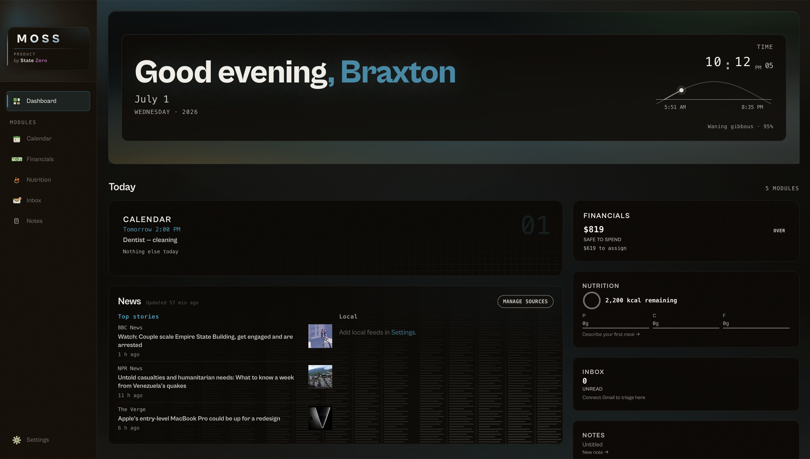

<div align="center">

# MOSS

**A calm, local-first dashboard for your daily life.**


</div>

MOSS puts the things you check every day — your calendar, your money, your meals, the news you choose, and your email — on one quiet screen. There's no account to create, no ads, and no feed engineered to keep you scrolling. There's also no server on our end: everything lives in an encrypted SQLite database on your own disk, and it stays there. It's built for average person looking to enhance their daily productivity with a ambient app thats easy to use. Open it in the morning, see your day, get on with it.



## What's inside

✅ means solid and daily-driven.

| | |
|---|---|
| ✅ | **Calendar** — Google Calendar or `.ics` import, week and month views, and quick add in plain English ("dentist Thursday at 2") |
| ✅ | **Money** — envelope budgeting, a running ledger, bill schedules, and an investments glance. All manual entry, on purpose: bank sync waits until we can do it in a way we'd trust with our own accounts |
| ✅ | **Nutrition** — describe a meal in plain English or search the USDA and Open Food Facts databases, with daily calorie and macro targets |
| ✅ | **News** — pick your outlets, get a glanceable briefing and a full reader. No algorithm, no infinite scroll |
| ✅ | **Email** — read, reply, and send with Gmail or any IMAP provider: iCloud, Fastmail, Yahoo, Zoho, Proton Bridge |
| ✅ | **Notes** — quick notes, folders, checklists, and maintenance lists, with instant search |
| ✅ | **Weekly score** — a "how was your week" glance built from your habits, budget, and meals. It only shows a number when there's real data behind it, and the formula is published |
| ✅ | **Profiles** — everyone on a shared computer gets their own separately-encrypted data, with an optional password and recovery phrase |

## Download

Grab the latest build from [GitHub Releases](../../releases), or [build from source](#build-from-source) — it takes about two minutes.

- **macOS** — unzip and drag `MOSS.app` into Applications. The first launch will trigger a warning, because we haven't paid Apple $99 for a developer certificate yet. **Right-click the app → Open**, and it never asks again.
- **Windows** — unzip and run `MOSS.exe`. SmartScreen objects for the same reason: click **More info → Run anyway**.

Unsigned builds are a leap of faith, and we won't pretend otherwise. Every line of code is here to read, signed installers come with 1.0, and building from source gives you the exact same app with nobody in between.

### Will it run on my computer?

Almost certainly. MOSS is local-first with no background sync, and the ambient visuals switch themselves off on machines that can't afford them (Settings → Look → Motion).

- **macOS** 11 Big Sur or newer — Apple Silicon or Intel
- **Windows** 10 or newer — 64-bit
- **Linux** — Ubuntu 20.04 or equivalent (AppImage or `.deb`)
- **Memory** — runs in 4 GB; 8 GB is comfortable
- **Disk** — about 500 MB. Your data itself is tiny (it's a SQLite file)
- **Graphics** — nothing special. If the ambient background ever feels heavy, set Motion to Reduced and it never loads

The optional smarter meal parsing uses [Ollama](https://ollama.com) and needs a beefier machine (8 GB+); everything else works without it.

## Build from source

You'll need [Node.js](https://nodejs.org) 20 or newer. Clone this repository, then:

```bash
npm install        # also rebuilds SQLite for Electron
npm run dev        # start MOSS with hot reload
```

To produce a packaged app for your platform:

```bash
npm run package    # output lands in release/
```

## Our privacy promise

- **Your data never leaves your machine.** It lives in an encrypted SQLite file on your own disk. There is no MOSS account and no MOSS server — we couldn't read your data if we wanted to.
- **No telemetry, no analytics, no ads.** MOSS talks only to the services you connect yourself: your mail provider, your calendar, the feeds you pick.
- **Leaving is easy.** Settings shows you exactly where your database lives. Copy the file to back it up; delete it and you're gone, completely.

The full accounting of what leaves your machine, and when, is in [PRIVACY.md](PRIVACY.md).

## Security

MOSS holds financial, health, and calendar data, so the security model — including its honest limits — is spelled out in [SECURITY.md](SECURITY.md). Found a vulnerability? Please [report it privately](SECURITY.md#reporting-a-vulnerability) rather than opening a public issue.

## License

[MIT](LICENSE) © 2026 StateZero. Dependency licenses: [THIRD_PARTY_LICENSES.md](THIRD_PARTY_LICENSES.md).
